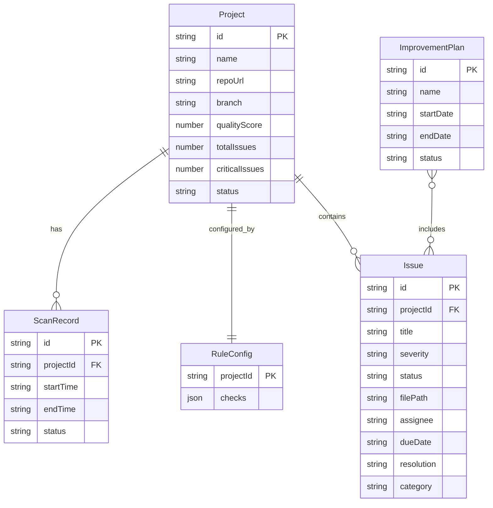

## 1. 架构设计

```mermaid
flowchart TB
    subgraph "前端层"
        "React 18 SPA"
        "React Router v6"
        "TailwindCSS 3"
        "Recharts 图表库"
    end
    subgraph "数据层"
        "Mock Data Service"
        "LocalStorage 持久化"
    end
    "React 18 SPA" --> "Mock Data Service"
    "Mock Data Service" --> "LocalStorage 持久化"
```

前端 SPA 架构，使用 Mock 数据模拟后端接口，LocalStorage 实现数据持久化。后期可无缝对接真实后端 API。

## 2. 技术说明

- **前端框架**：React@18 + TypeScript
- **样式方案**：TailwindCSS@3 + CSS Variables（主题色）
- **构建工具**：Vite
- **路由**：React Router v6
- **图表库**：Recharts（轻量级、React 友好）
- **图标库**：Lucide React
- **后端**：无（使用 Mock 数据 + LocalStorage）
- **数据库**：无（前端本地存储）

## 3. 路由定义

| 路由 | 用途 |
|------|------|
| `/` | 项目总览页 - 展示所有项目卡片和整体质量统计 |
| `/scan` | 质量扫描页 - 仓库接入、扫描控制台、扫描结果仪表盘 |
| `/issues` | 问题列表页 - 筛选、分派、处理问题 |
| `/rules` | 规则配置页 - 按项目配置检查项和阈值 |
| `/plans` | 改进计划页 - 创建和跟踪改进计划 |
| `/dashboard` | 团队看板页 - 趋势、排行、风险面板 |

## 4. API 定义（Mock）

### 4.1 项目相关

```typescript
interface Project {
  id: string;
  name: string;
  repoUrl: string;
  branch: string;
  lastScanTime: string | null;
  qualityScore: number;
  totalIssues: number;
  criticalIssues: number;
  status: 'connected' | 'disconnected' | 'scanning';
}

// GET /projects - 获取项目列表
// POST /projects - 添加项目
// GET /projects/:id - 获取项目详情
```

### 4.2 扫描相关

```typescript
interface ScanRecord {
  id: string;
  projectId: string;
  startTime: string;
  endTime: string | null;
  status: 'running' | 'completed' | 'failed';
  results: ScanResults;
}

interface ScanResults {
  duplicateCodeRate: number;
  cyclomaticComplexity: number;
  defectRiskCount: number;
  dependencyVulnerabilities: number;
  testCoverage: number;
}

interface ScanSchedule {
  projectId: string;
  enabled: boolean;
  cron: string;
  nextRun: string;
}

// POST /scans - 发起扫描
// GET /scans/:projectId - 获取扫描历史
// GET /scans/:projectId/latest - 获取最新扫描结果
// PUT /scans/schedule/:projectId - 配置定时扫描
```

### 4.3 问题相关

```typescript
type SeverityLevel = 'critical' | 'high' | 'medium' | 'low';
type IssueStatus = 'open' | 'assigned' | 'in_progress' | 'resolved' | 'closed';

interface Issue {
  id: string;
  projectId: string;
  projectName: string;
  title: string;
  description: string;
  severity: SeverityLevel;
  status: IssueStatus;
  filePath: string;
  lineStart: number;
  lineEnd: number;
  assignee: string | null;
  dueDate: string | null;
  resolution: string | null;
  createdAt: string;
  updatedAt: string;
  category: 'duplicate' | 'complexity' | 'defect' | 'vulnerability' | 'coverage';
}

// GET /issues - 获取问题列表（支持筛选参数）
// PUT /issues/:id - 更新问题（分派、设置截止时间、记录修复说明）
// GET /issues/stats - 获取问题统计
```

### 4.4 规则相关

```typescript
interface RuleConfig {
  projectId: string;
  checks: CheckConfig[];
}

interface CheckConfig {
  id: string;
  name: string;
  category: 'duplicate' | 'complexity' | 'defect' | 'vulnerability' | 'coverage';
  enabled: boolean;
  threshold: number;
  description: string;
}

// GET /rules/:projectId - 获取项目规则配置
// PUT /rules/:projectId - 更新项目规则配置
```

### 4.5 改进计划相关

```typescript
type PlanStatus = 'active' | 'completed' | 'overdue';

interface ImprovementPlan {
  id: string;
  name: string;
  description: string;
  startDate: string;
  endDate: string;
  status: PlanStatus;
  issueIds: string[];
  completedIssueIds: string[];
  createdAt: string;
}

// GET /plans - 获取改进计划列表
// POST /plans - 创建改进计划
// GET /plans/:id - 获取计划详情
// PUT /plans/:id - 更新计划
// PUT /plans/:id/issues/:issueId/complete - 标记问题完成
```

### 4.6 团队看板相关

```typescript
interface TeamDashboard {
  qualityTrend: TrendDataPoint[];
  issueTrend: TrendDataPoint[];
  rankings: TeamRanking[];
  unresolvedRisks: Issue[];
}

interface TrendDataPoint {
  date: string;
  value: number;
}

interface TeamRanking {
  member: string;
  qualityScore: number;
  resolvedCount: number;
  openIssueCount: number;
  avgResolutionDays: number;
}

// GET /dashboard - 获取团队看板数据
```

## 5. 数据模型


